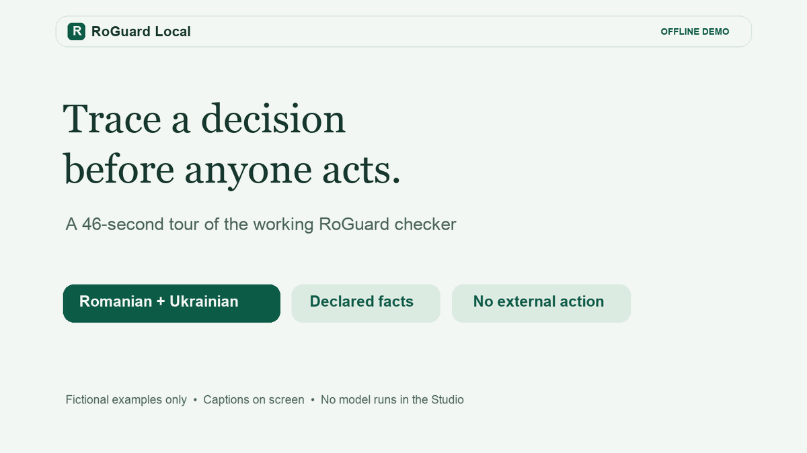

# RoGuard Local — Romanian and Ukrainian child-safety research toolkit

[](media/roguard-demo.mp4)

**[Open the full-resolution 46-second video](media/roguard-demo.mp4)** · [Read the transcript](docs/DEMO_VIDEO.md)

**RoGuard Local v1.0.0 is an offline contract checker and evaluation toolkit. Text-model validation remains open.** It checks caller-declared child-safety contracts and supports Romanian and Ukrainian abstract-card research. It does not read a child message to decide whom to notify, and it takes no external action. Trained text models are experimental, are not included in this release, and have not been validated on authentic child language. The [v1.0 release scope](docs/V1_RELEASE.md) states exactly what is included.

This project is independent of Roblox. [Roblox Guard 1.0](https://about.roblox.com/newsroom/2025/07/roblox-guard-advancing-safety-for-llms-with-robust-guardrails) is a separate LLM moderation toolkit; there is no affiliation, shared model, or compatibility claim. The package here is named `roguard-local`.

## What the checker does

Each check compares **facts supplied by the caller** with a declared rule. The tool marks those facts as unverified; it does not establish whether a person's account is true, who holds legal authority, or whether a proposed response is helpful in a real case.

| Code | Check | Python function | What the result means |
|---|---|---|---|
| D1 | Declared disclosure and support-signal fields | `check_disclosure_evidence` | Checks the caller's field declarations; does not interpret a child's words. |
| R1 | Recipient and purpose scope | `check_routing` | Checks whether the proposed recipient fits an explicit rule. A relationship alone grants no access. |
| A1 | Declared or locally counted words against a caller-supplied cap | `check_readability_contract` | Checks length only. It does not measure readability or comprehension. |
| P1 | Permission state and repeated boundary pressure | `check_permission`, `check_boundary` | Checks declared permission events and boundary facts. `check_boundary` is part of P1. |
| G1 | Human-review gate before an external action | `check_gate` | Flags an automatic external branch or a missing review owner in the declared flow. |
| S1 | Declared support-response fields | `check_support_contract` | Checks fields marked applicable by the caller; does not judge a real reply. |

The design couples explicit person–item–purpose–recipient rules and permission history with one-fact counterfactual tests. It keeps model signals separate from authority and external-action decisions; the [novelty note](docs/NOVELTY.md) states the narrower research contribution and prior-work limits.

The CLI can count A1 words locally when text is supplied; the cap still comes from the caller. The historical [Romanian v0.2 taxonomy](taxonomy/taxonomy_ro.md) and [Ukrainian draft v0.1 taxonomy](taxonomy/taxonomy_uk.md) remain bound to their original batches. The corrected [Romanian v1 candidate](taxonomy/taxonomy_ro_v1_candidate.md) and [Ukrainian v1 candidate](taxonomy/taxonomy_uk_v1_candidate.md) incorporate the later specialist review. The owner-attested, exact-version taxonomy review records now pass structural checks; the model study gate remains open. The [taxonomy review disposition](docs/TAXONOMY_REVIEW_V1.md) and [v1 evidence ledger](docs/V1_EVIDENCE.md) explain the open gates.

A **synthetic abstract card** is an invented description of annotation fields or policy facts, with no real or realistic child statement. A **complete one-fact pair** is a positive card and its minimally changed negative, both classified correctly. Those pairs measure an invented-card task, not accuracy on children's messages. When a professional has reporting duties, this software does not determine or replace them; follow applicable law, organizational policy, and qualified human judgment.

## Install and try it

The public [GitHub releases](https://github.com/xyz-rafael-xyz/roguard-child-safety/releases/latest) provide source archives and a wheel. CI tests Python 3.9 through 3.14. On macOS or Linux:

```sh
git clone https://github.com/xyz-rafael-xyz/roguard-child-safety.git
cd roguard-child-safety
python3 -m venv .venv
.venv/bin/python -m pip install .
.venv/bin/python -m roguard examples/contracts_ro.json
.venv/bin/python -m roguard examples/contracts_uk.json
```

On Windows, create the environment with `py -3.12 -m venv .venv` and use `.venv\Scripts\python.exe` in the last three commands. The examples are fictional, caller-declared contracts; no model download is needed. For your own declared contract, copy an [example](examples/contracts_ro.json), edit its fields, and run the same command. The [JSON Schema](schema/contract-input.schema.json) and [CLI guide](docs/CLI.md) describe every field and status.

`roguard-studio --open` opens a loopback-only [Decision Studio](docs/DECISION_STUDIO.md) for checking contracts and exploring one-fact changes. The command-line `roguard-explore examples/proposed_use_ro.json` shows which declared changes alter a result. Both are local consistency tools, not model accuracy tests. `python -m roguard --jsonl examples/contracts_mixed.jsonl` checks multiple contracts after validating every line.

For a small routing check in Python:

```python
from roguard import RoutingCard, check_routing

card = RoutingCard(
    principal="minor",
    item="element-simbolic",
    purpose="A",
    proposed_recipient="părinte",
    recipient_roles=frozenset({"minor", "părinte"}),
    allowed_by_scope={
        ("minor", "element-simbolic", "A"): frozenset({"minor"})
    },
)
print(check_routing(card).reason_codes)  # ('PRINCIPAL_SCOPE_CONFLICT',)
```

`părinte` here is an example role label, not a finding about legal authority or safe disclosure. A parent or guardian can be the subject of a concern; the checker must not infer permission to notify them from that relationship. The responsible human must assess the actual policy and situation. The [combined-use guide](docs/CLI.md#check-one-proposed-use-across-contracts) shows how routing, current permission, and a separate human gate fit together without sending anything.

For the **reviewed v1 contract rules**, run `roguard-v1-contract examples/v1_candidate_ro.json` or `roguard-v1-contract examples/v1_candidate_uk.json`. These separate examples exercise a direct D1 statement, an unresolved R1 recipient concern, and conditional S1 fields. The [v1 schema](schema/v1-contract-input.schema.json) describes the new inputs. These checks operate on facts supplied by the caller; they are not live screening or model inference.

## What the research shows

**The mixed-input result is not six-category text understanding.** Four categories in the 72/72 workflow received typed facts; D1 and S1 used a frozen model on abstract-card text. The same text-only model scored 55/72 and missed every A1 positive. A separate frozen Romanian D1/S1 model scored 47/48 on one abstract wording surface and 23/48 on another. This sensitivity is why no trained adapter is offered for live screening.

| Study on synthetic abstract cards | Complete pairs | Descriptive 95% Wilson interval | Interpretation |
|---|---:|---:|---|
| Romanian mixed input, with four typed-fact categories | 72/72 | 94.9–100% | Passed its narrow registered target; text-only comparator was 55/72 (65.4–84.7%). |
| Romanian D1/S1, frozen model, batch 0025 | 47/48 | 89.1–99.6% | Passed its narrow target on one wording surface. |
| Same frozen model, batch 0027 | 23/48 | 34.5–61.7% | Failed on new abstract prose; S1 recall was 8/24. |
| Bilingual V25 sealed synthetic test | 165/192 | 80.3–90.2% | Failed its fixed per-cell target; Ukrainian D1 was 36/48 and S1 was 38/48. |
| Private V30 fresh synthetic test | 129/192 | 60.3–73.4% | Failed; Ukrainian D1 was 2/48. |
| Private V31 fresh synthetic test | 143/192 | 67.9–80.1% | Failed; Romanian D1 was 13/48. |

All model results in this table are **author-reported**. Selected adapter weights and their Git history are in a separate private research archive, so public readers cannot replay weight-dependent results from this checkout. The [benchmark ledger](BENCHMARK.md) retains the study-by-study results, including failures and development-only diagnostics; the [public-release note](docs/PUBLIC_RELEASE.md) explains what CI can reproduce. Wilson intervals are descriptive for each count and may be optimistic when paired cards share wording or authoring patterns. No row estimates performance on authentic Romanian or Ukrainian child language.

The research adapters are not included in the public wheel. Publishing weights is a separate decision involving base-model licences, privacy review, and the project's release rules. The local checker remains usable without them.

Authors in the corrected-v1 abstract study can check a completed JSON workbook against their original, private author ZIP with `roguard-v1-author-check issued-packet.zip completed-workbook.json`. The command checks the assigned factor order, metadata, date, and basic card format without printing card text. It cannot verify who authored the work, whether a pair changes one fact, or whether work actually occurred after the model freeze. The study owner performs those separate checks before blind packets are made.

## Specialist feedback and v1 status

The project owner supplied two specialist memos. The first addressed the README and said the taxonomy had not been read; its [disposition](docs/REVIEW_FEEDBACK_V2.md) remains on record. The second reviewed the taxonomies and attributed comments to a **Romanian child-protection practitioner**, a **Ukrainian plain-language linguist**, and a **child online-safety policy and evaluation specialist**. Their names are withheld. The memo rejected D1 in both earlier taxonomies, gave conditional judgments on most other categories, and required a new review of the corrected exact text. The [v1 disposition](docs/TAXONOMY_REVIEW_V1.md) records every requested change. A later [four-role submission](docs/REVIEW_SUBMISSION_V1.md) marks all six corrected categories accepted at matching digests; the owner has attested to four distinct independent reviewers and reports that they confirmed the category comments. Names and contacts remain off Git. The repository cannot verify reviewer identity or independence, and none of these documents validates model accuracy.

`roguard-v1-review --root .` reports both candidate taxonomy review records structurally approved under the owner attestation. `roguard-v1-evidence --root .` audits only the historical study pipeline and still reports its four independent abstract-study cells blocked. A separate [corrected-v1 study protocol](docs/V1_CANDIDATE_STUDY_PROTOCOL.md) and evaluator bind the reviewed taxonomies in the private archive. Four pre-author V25 comparator freezes and content-free blank author-kit hashes are committed there. The owner confirms 12 distinct, language-fluent participants in separate author, annotator, content-review, and adjudicator roles. The owner later supplied eight JSON files as final author material. Their schema and factors do not match the registered D1/S1 study, so no independent accuracy score was produced and no further submissions are requested. The V25 models remain comparators; earlier scores do not carry over. The [reviewer handoff](docs/REVIEWER_HANDOFF.md), [historical validation protocol](docs/HUMAN_VALIDATION_PROTOCOL.md), and [v1 evidence ledger](docs/V1_EVIDENCE.md) state the evidence and claim boundaries.

## Pe scurt, în română

RoGuard Local verifică reguli și câmpuri **declarate de apelant**; nu citește singur relatarea unui copil și nu trimite notificări. A1 compară numărul de cuvinte cu un plafon ales de apelant, fără a măsura ușurința de înțelegere. Specialiștii au cerut corecturi ale vechii taxonomii; [candidatul v1 în română](taxonomy/taxonomy_ro_v1_candidate.md) aplică observațiile și are acceptul pentru textul exact consemnat sub atestarea titularului proiectului. Modelele au rezultate instabile pe fișe abstracte inventate și nu sunt validate pentru mesaje reale. Consultați [rezultatele complete](BENCHMARK.md) și [stadiul v1](docs/V1_EVIDENCE.md).

## Коротко українською

[Українську чернетку v1](taxonomy/taxonomy_uk_v1_candidate.md) виправлено за фаховими заувагами; її точний текст отримав схвалення, зафіксоване за підтвердженням власника проєкту. Локальна програма перевіряє правила й поля, які задає користувач, але не є перевіреним детектором дитячих повідомлень. Публічний виклик `screen()` для експериментальної текстової моделі працює лише з румунською; приватний двомовний V25 є дослідницьким компаратором і не пройшов свій тест на вигаданих абстрактних картках. Жодна функція не надсилає повідомлень і не виконує зовнішніх дій; [результати](BENCHMARK.md) та [умови для v1](docs/V1_EVIDENCE.md) наведено окремо.
